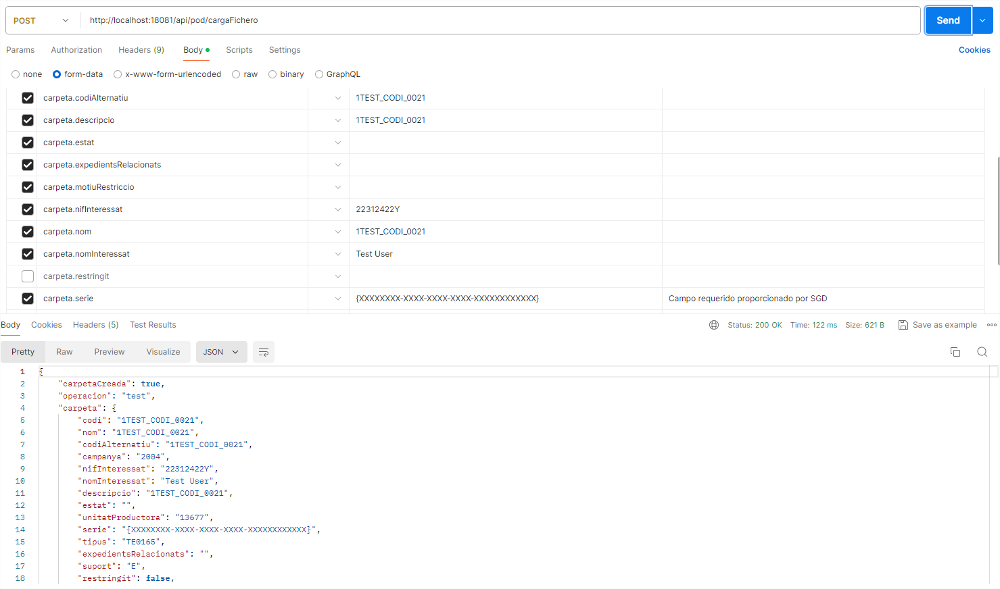

# Spring Boot + Feign Client + @ModelAttribute + multipart/form-data
Esta aplicación utilizará Spring boot + Feign client + @ModelAttribute y multipart/form-data
Demostrando que existe un problema al mapear objecto (POJOS) estructurado y que su contenido no se mapea correctamente, dando la soluciona a ello.

## Caso: Al utilizar Feign Client con @ModelAttribute con multipart/form-data y no se mapea correctamente el objeto
Se tiene un servicio en donde se espera cargar un fichero y además recibiremos un objeto estructurado.
En este ejemplo veremos que el objeto estructurado al utilizar @ModelAttribute no se mapea correctamente.

### Servicio de ejemplo - Controller
```java
import cimacg.poc.feign.modelattribute.model.PocMetadatosEstructurados;
import org.springframework.http.HttpStatus;
import org.springframework.http.MediaType;
import org.springframework.http.ResponseEntity;
import org.springframework.stereotype.Controller;
import org.springframework.web.bind.annotation.ModelAttribute;
import org.springframework.web.bind.annotation.PostMapping;
import org.springframework.web.bind.annotation.RequestParam;
import org.springframework.web.multipart.MultipartFile;

/**
 * ControllerPoc Clase que implementa el controlador que utilizaremos para la carga de ficheros y en conde queremos demostrar
 * que los datos se mapean al utilizar @ModelAttribute
 * También donde explicaremos como solucionar el problema del mapeo al utilizar @ModelAttribute
 */
@Controller
public class ControllerPoc {

    /**
     * Método que utilizaremos para cargar un fichero y donde mostraremos como se mapean los datos al utilizar @ModelAttribute
     * Este servicio solo pasara los valores que recibimos y en donde notaremos que el mapeo no se realiza correctamente si no ajustamos el modelo de clases.
     * @param multipartFile Fichero que queremos cargar
     * @param pocMetadatosEstructurados Parámetros que utilizaremos para cargar el fichero
     * @return ResponseEntity<PocMetadatosEstructurados> Devuelve los parámetros que hemos utilizado para cargar el fichero
     */
    @PostMapping(value = "/api/pod/cargaFichero"
            , consumes = MediaType.MULTIPART_FORM_DATA_VALUE
            , produces = MediaType.APPLICATION_JSON_VALUE)
    public ResponseEntity<PocMetadatosEstructurados> cargaFichero(
            @RequestParam(value = "file", required = false) MultipartFile multipartFile,
            @ModelAttribute("cargaFichero") PocMetadatosEstructurados pocMetadatosEstructurados) {
        return new ResponseEntity<>(pocMetadatosEstructurados, HttpStatus.OK);
    }
}
```
Como veran el servicio devuelve el mismo objeto que recibe.

### Modelo - Pojo que se utilizará para los parámetros del servicio y el mapeo los datos
```java
/**
 * PocMetadatosEstructurados Clase que utilizaremos como parámetros del servicio de @ModelAttribute
 */
@Data
@Builder
@AllArgsConstructor
@NoArgsConstructor
public class PocMetadatosEstructurados {
	private Boolean carpetaCreada;
	private String operacion;
	private PocCarpeta carpeta;
	private PocFichero fichero;
	private PocRelacion relacion;
}
```
```java
@Data
@Builder
@AllArgsConstructor
@NoArgsConstructor
public class PocCarpeta {
    private String codi;
    private String nom;
    private String codiAlternatiu;
    private String campanya;
    private String nifInteressat;
    private String nomInteressat;
    private String descripcio;
    private String estat;
    private String unitatProductora;
    private String serie;
    private String tipus;
    private String expedientsRelacionats;
    private String suport;
    private boolean restringit;
    private String motiuRestriccio;
}
```

### Cliente - PostMan
Para probar el servicio utilizaremos Postman y veremos que el objeto nos llega correctamente.


### Cliente - Feign - java
Ahora, implementaremos el cliente REST utilizando Feign en donde notaremos el objeto no se mapea correctamente.

```java
import cimacg22.poc.feign.modelattribute.model.*;
import org.springframework.cloud.openfeign.FeignClient;
import org.springframework.http.MediaType;
import org.springframework.http.ResponseEntity;
import org.springframework.web.bind.annotation.*;
import org.springframework.web.multipart.MultipartFile;
/**
 * FeignClient para la comunicación con el servicio
 */
@FeignClient(name = "POC", url = "${cimacg22.poc.url}", configuration = FeignConfiguracion.class)
public interface FeignPocClient {

    /**
     * Muestra un cliente del servicio "Carga de fichero"
     *
     * @param token         token de seguridad
     * @param multipartFile fitxer a carregar
     * @param pocMetadatosEstructurados paràmetres con el modelo de datos estructurado.
     * @return resposta de la crida
     */
    @PostMapping(value = "/api/pod/cargaFichero"
            , consumes = {MediaType.MULTIPART_FORM_DATA_VALUE}
            , produces = MediaType.APPLICATION_JSON_VALUE)
    ResponseEntity<CarregaParamsDto> cargaFichero(@RequestHeader("Authorization") String token,
                                   @RequestParam(value = "file", required = false) MultipartFile multipartFile,
                                   @ModelAttribute("cargaFichero") PocMetadatosEstructurados pocMetadatosEstructurados);
}
```